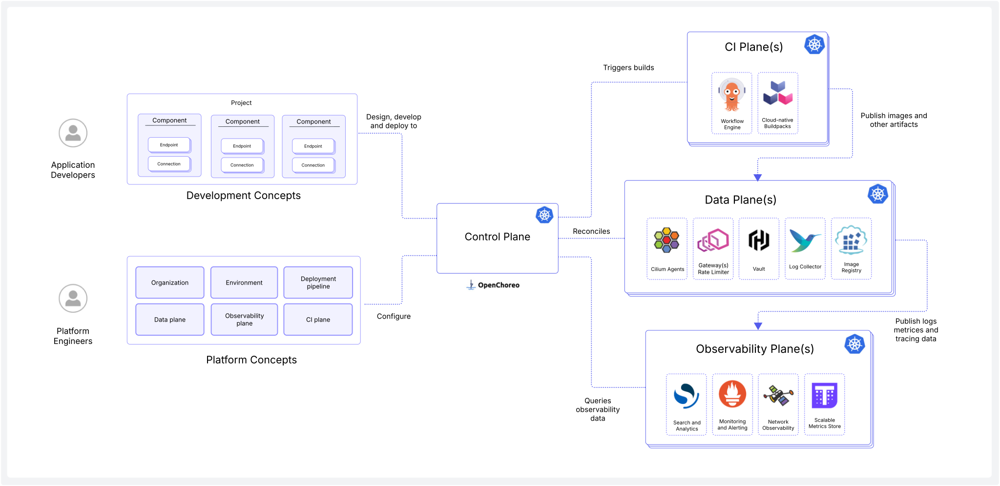
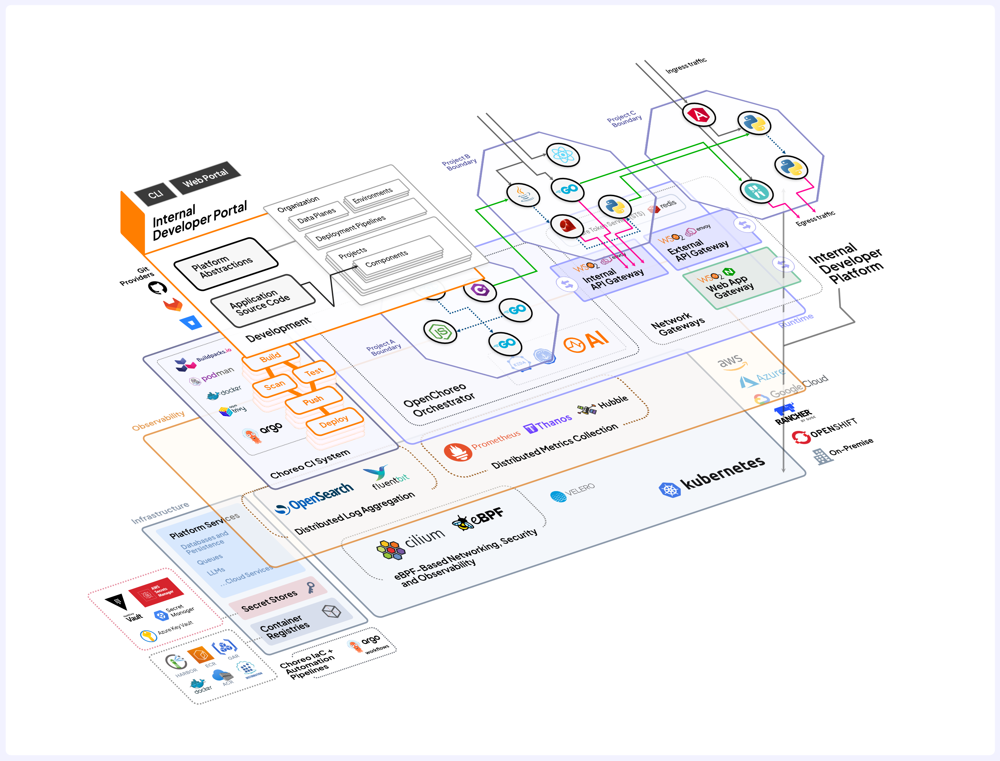

# OpenChoreo Architecture

OpenChoreo is architected as a modular, Kubernetes-native control plane that integrates deeply with other open-source projects to provide a comprehensive, extensible Internal Developer Platform (IDP).

The Control Plane acts as the orchestrator, transforming high-level platform and developer intent into actionable workloads deployed across CI, Data planes, while wiring them into the Observability plane for visibility.

The diagram below illustrates how these components interact.

Each plane in OpenChoreo operates as a distinct functional unit, with its own lifecycle, scaling behavior, and security boundaries. Together, these planes and supporting interfaces form the core components of the platform:
- [Control Plane](#control-plane)
- [Developer API](#developer-api)
- [Platform API](#platform-api)
- [Data Plane](#data-plane)
- [CI Plane](#ci-plane)
- [Observability Plane](#observability-plane)

## Control Plane

The brain of OpenChoreo. It watches developer- and platform-defined CRDs, validates and processes them, and coordinates activities across other planes. It translates intent such as "deploy this component" or "connect these services" into concreteinfrastructure actions. 

Responsibilities include:
	•	Validating CRD instances and resolving references (e.g., Connections between Components)
	•	Applying policy and environment-specific rules
	•	Coordinating CI jobs, deployments, and observability configs
	•	Reconciling desired state with actual state across all planes
	•	Tracking the state of Components across environments and Data Planes

The Control Plane is extensible, allowing integration with different backends for image building, observability tooling, environment provisioning, and more.

## Developer API
The Developer API is a set of Kubernetes CRDs designed to simplify cloud-native application development. It provides self-service, low-cognitive-load abstractions so developers don’t have to deal with Kubernetes internals. 

These abstractions align with the Domain-Driven Design principles, where projects represent bounded contexts and components represent the individual services or workloads within a domain. Developers use these abstractions to describe the structure and intent of the application in a declarative manner without having to deal with runtime infrastructure details. 

- **Project**
  - A cloud-native application composed of multiple components. Serves as the unit of isolation.
  - Maps to a set of Namespaces (one per Environment) in one or more Data planes.
- **Component**
  - A deployable unit within a project, such as a web service, API, worker, or scheduled task.
  - Maps to workload resources like Deployment, Job, or StatefulSet.
- **Endpoint**
  - A network-accessible interface exposed by a component, including routing rules, supported protocols, and visibility scopes (e.g., public, organization, project).
  - Maps to HTTPRoute (for HTTP), Service resources, and routes via shared ingress gateways. Visibility is enforced via Cilium network policies.
- **Connection**
  - An outbound service dependency defined by a component, targeting either other components or external systems.
  - Maps to Cilium network policies and is routed through egress gateways.

## Platform API 
The Platform API enables platform engineers to configure the overall platform topology. These CRDs define organizational boundaries, environment structure, runtime clusters, and automation logic.

- **Organization**
  - A logical grouping of users and resources, typically aligned to a company, business unit, or team. 
- **Data Plane**
  - A Kubernetes cluster to host one or more of your deployment environments.
- **Environment**
  - A runtime context (e.g., dev, test, staging, prod) where workloads are deployed and executed.
- **Deployment Pipeline**
  - A defined process that governs how workloads are promoted across environments.
- **CI Plane**
  - A Kubernetes cluster dedicated to running continuous integration (CI) jobs and pipelines.
- **Observability Plane**
  - A Kubernetes cluster focused on collecting and analyzing telemetry data (logs, metrics, traces) from all other planes.

## Data Plane
The Data Plane consists of one or more Kubernetes clusters where application workloads run. It is enhanced with eBPF-based zero-trust networking (via Cilium), observability tooling, and API management components to ensure secure and scalable communication.

To support multi-tenancy, environment isolation, and domain-driven design, the OpenChoreo Control Plane maps each Project in a given Environment (e.g., dev, staging, prod) to a dedicated Kubernetes namespace in the Data Plane.

In OpenChoreo, we refer to this namespace as a Cell — a secure, isolated, and observable boundary for all components belonging to that project-environment combination. The Cell becomes the unit of deployment, policy enforcement, and observability, aligning with the [cell-based architecture](https://github.com/wso2/reference-architecture/blob/master/reference-architecture-cell-based.md) pattern: a model where individual teams or domains operate independently within well-defined boundaries, while still benefiting from shared infrastructure capabilities.

- **Cell** 
  - A Cell is the runtime reification of a single project in OpenChoreo. It encapsulates all components of a project and controls how they communicate internally and externally through well-defined ingress and egress paths.
  - Communication between components in the same cell is permitted without interception.
  - Cilium and eBPF are used to enforce fine-grained network policies across all ingress and egress paths.
- **Northbound Ingress**
  - Routes incoming traffic from external (internet) sources into the cell.  
  - Endpoints with `visibility: public` are exposed through this ingress path.
- **Southbound Egress**
  - Handles outbound Internet access from components in the Cell. Connections to external services are routed through this egress path. 
- **Westbound Ingress**
  - Handles traffic entering the Cell from within the organization, be it from another cell or just from the internal network. 
  - Endpoints with `visibility: organization` are exposed through this ingress path.
- **Eastbound Egress**
  - Handles outbound traffic to other cells or to the internal network.

## CI Plane

The CI Plane in OpenChoreo provides dedicated infrastructure for executing continuous integration workflows, separating build-time activities from runtime environments. It ensures that tasks such as source code compilation, container image creation, and test execution are performed in a secure, isolated, and scalable environment, without interfering with the application runtime.

By default, the CI Plane is powered by Argo Workflows, a Kubernetes-native workflow engine. However, OpenChoreo is designed to be flexible, you can customize the CI Plane to use an alternative engine like Tekton, depending on your organizational needs.

While tightly integrated, the CI Plane is an optional component. If you already have an existing CI system, such as GitHub Actions, GitLab CI, or Jenkins, you can continue to use it instead of OpenChoreo’s built-in CI. In this setup, OpenChoreo can ingest externally built container images and proceed with deployment and observability workflows as usual.

## Observability Plane

The Observability Plane in OpenChoreo provides centralized logging infrastructure across all planes, enabling platform-wide monitoring, debugging, and analytics. It collects and aggregates logs from the Control, Data, and CI planes using a distributed log collection pattern powered by Fluent Bit agents. These agents run on each plane, enrich logs with metadata (such as plane, organization, project, and component), and forward them to a central OpenSearch cluster.

OpenSearch serves as the core log aggregation and search platform, supporting full-text search, structured/unstructured log storage, configurable retention, and complex queries. On top of this, the Observer API provides a secure, unified interface for querying logs, with fine-grained filtering by organization, project, or component, making it easy to integrate with external tools and dashboards.

Unlike other planes, the Observability Plane doesn’t require its own CRDs. It operates independently after its initial Helm-based setup. Each participating plane integrates by configuring Fluent Bit to stream logs to OpenSearch using authenticated credentials. The Observer API then provides read-only access to this log data, ensuring that observability remains a first-class, yet decoupled, aspect of the platform.

## Full System View
The diagram below shows a complete view of the OpenChoreo Internal Developer Platform, including how platform abstractions, developer workflows, and control planes interact with runtime infrastructure and cloud-native tools.

This view illustrates the full path from source code and platform configuration through build, deployment, API exposure, and runtime observability — all orchestrated by OpenChoreo.

## Deployment Topologies
OpenChoreo supports multiple deployment patterns to suit different organizational needs, from local development to large-scale, multi-cluster production setups.
	•	In development or testing setups, all planes can be deployed into a single Kubernetes cluster using namespace isolation.
	•	In production environments, each plane is typically deployed in a separate cluster for scalability, fault tolerance, and security.
	•	Hybrid topologies are also supported, allowing teams to colocate certain planes (e.g., Control + CI) for cost or operational efficiency.
